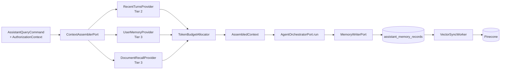

# Context & Memory Management — Integration Plan

Status: implemented baseline with follow-up options
Date: 2026-08-22
Scope: `src/app/modules/assistant`, `src/app/modules/documents`, `src/app/core/config.py`, `src/app/container.py`

---

## 1. Objective

The assistant now uses a **Context Assembly** stage before the primary `LangGraphAgentOrchestrator`, backed by a three-tier memory model. This document records the implemented baseline and the remaining optional enhancements.

---

## 2. Confirmed decisions

| #   | Topic               | Decision                                                                                                                                            |
| --- | ------------------- | --------------------------------------------------------------------------------------------------------------------------------------------------- |
| 1   | Multi-tenancy       | Out of scope. No `tenant_id`. Keep `site_code` (already on `AuthorizationContext`).                                                                 |
| 2   | Memory sharing      | **User-scoped.** Long-term recall filtered by `owner_user_id`. No cross-user recall in v1.                                                          |
| 3   | Latency budget      | p95 < 8 s. Synchronous query-embedding and vector search are acceptable; summarization is asynchronous.                                             |
| 4   | Vector store        | **Pinecone** (external). Implies no cross-store transaction → outbox-style sync + Postgres mirror.                                                  |
| 5   | Retention           | 90 days verbatim turns, 180 days summaries. `source_turn_ids` lineage from the first migration. No PII redaction in v1.                             |
| 6   | `documents` module  | Serves the **offline RAG feed**. Ingestion pipeline must be built (none exists today).                                                              |
| 7   | Conversation length | 2–4 turns typical. Mid-conversation rolling summarization is low value → consolidate at **end of conversation** into long-term user memory instead. |

---

## 3. Memory tier vocabulary

The canonical three-tier model; storage substrates sit beneath each tier.

| Tier                    | Role                                    | Substrate                                                                          |
| ----------------------- | --------------------------------------- | ---------------------------------------------------------------------------------- |
| **Tier 1 — Working**    | What is in the context window right now | `GraphState`, LangGraph checkpointer, the assembled prompt                         |
| **Tier 2 — Short-term** | Recent session history                  | `assistant_conversation_turns` (verbatim, 90-day TTL)                              |
| **Tier 3 — Long-term**  | Persistent knowledge beyond the session | Pinecone vectors + Postgres mirror (conversation summaries 180 d, document chunks) |

Prompt templates and tool hints are **configuration, not memory** — they stay versioned in the repository.

---

## 4. Target architecture



### Architectural rules

1. **Pinecone is not the source of truth.** Every vector has a `assistant_memory_records` mirror row. Retention and erasure enumerate Postgres, then delete from Pinecone. Prevents orphan vectors and makes GDPR-style erasure tractable.
2. **Memory reads bypass `ToolGateway`**, so every long-term recall path must take an `AuthorizationContext` and enforce scope itself — in the vector metadata filter *and* again in SQL.
3. **The budget allocator is pure.** No LLM involvement in deciding what fits; deterministic shares with priority spill and a stable drop order.
4. **Provider failure never fails the request.** The assembler logs and continues with fewer blocks.

---

## 5. Current-state facts (grounded)

- [use_cases.py](../src/app/modules/assistant/application/use_cases.py) calls `conversation_store.read_recent(conversation_id, limit=12)` — hardcoded.
- [agent_brain.py](../src/app/modules/assistant/infrastructure/agents/langgraph/agent_brain.py) does `json.dumps([asdict(turn) …])` on both history **and** tool results — unbounded prompt growth.
- [state.py](../src/app/modules/assistant/infrastructure/agents/langgraph/state.py) carries `conversation_history: list[ConversationTurn]`.
- [orchestrator.py](../src/app/modules/assistant/infrastructure/agents/langgraph/orchestrator.py) has a `checkpointer` field, but [wiring.py](../src/app/modules/assistant/wiring.py) never passes one.
- [postgres_conversation_store.py](../src/app/modules/assistant/infrastructure/conversation_memory/postgres_conversation_store.py) hard-deletes by count offset — lossy, no age logic, no audit.
- `ConversationTurnRecord` columns: `id`, `conversation_id`, `role`, `content`, `created_at`. **No `owner_user_id`.**
- `AuthorizationContext`: `user_id: UUID`, `roles: frozenset[RoleName]`, `site_codes: frozenset[str]`, `global_scope: bool`, plus `.permissions` and `.can(permission, site_code=None)`.
- `OutboxRecord` / [outbox_publisher.py](../src/app/modules/documents/infrastructure/outbox_publisher.py) already implement polling with `SELECT … FOR UPDATE SKIP LOCKED`, retry counting, and exponential backoff with jitter — **reuse this pattern**.
- `ToolDefinition` carries `required_permission`, `site_code_field`, `rate_limit`, `side_effect_type`.
- Dependencies already present: `tiktoken`, `langgraph-checkpoint-postgres`, `langchain-postgres`, `langchain-openai`, `confluent-kafka`, `structlog`, `prometheus-client`. **No Pinecone client yet.**
- No chunking, embedding, or vector code exists anywhere in the repository.

---

## 6. Current implementation status

| Capability            | Status   | Current implementation                                                                                                                                                    |
| --------------------- | -------- | ------------------------------------------------------------------------------------------------------------------------------------------------------------------------- |
| Primary orchestration | Complete | `LangGraphAgentOrchestrator`; `AssembledContext.render()` supplies working context. The legacy `conversation_history` graph field is initialized empty.                   |
| Tool runtime          | Complete | `GatewayToolRuntime`, `ToolRegistry`, and `ToolGateway`; no `GuardedLocalRegistryRuntime` or `LocalToolRegistry` path is used.                                            |
| Context budget        | Complete | `DefaultContextAssembler`, `TokenBudgetAllocator`, `RecentTurnsProvider`, and `UserMemoryProvider`.                                                                       |
| Short-term memory     | Complete | Durable owner-scoped turns, conversation records, expiry, and `ShortTermRetentionJob`.                                                                                    |
| Long-term memory      | Complete | Postgres mirror records, Pinecone sync, reconciliation, retention, and user erasure.                                                                                      |
| Offline ingestion     | Complete | Blob download, extraction, token-aware chunking, durable chunk records, and asynchronous vector sync.                                                                     |
| Document retrieval    | Complete | `DocumentRecallProvider` requires `DOCUMENTS_READ`; Pinecone returns candidates, then Postgres rechecks required permissions and site scope before chunks enter context.  |
| Fact interaction      | Complete | `LlmFactExtractor` proposes structured facts; `FactAcceptancePolicy`, candidate diagnostics, `FactPromoter`, and exact user-scoped hash deduplication decide persistence. |

### Fact interaction rules

- `act_policy.py` classifies only `PREFERENCE`, `ENTITY_AFFINITY`, `EPISODIC_REFERENCE`, `DOMAIN_CONSTRAINT`, and `ATTRIBUTED_OPINION` as storable.
- Each candidate must cite turn IDs from its source conversation. Facts without valid evidence are rejected.
- Tool-output field names are collected from `ToolRegistry` during wiring and used as re-derivable exclusions. Current metrics, statuses, dates, quantities, and authorization-related assertions are not promoted.
- A candidate record is retained for 30 days for diagnostics. Valid candidates are promoted immediately; no human approval or corroboration threshold runs in v1.
- Promoted user facts use a normalized content hash with an active user-scoped uniqueness constraint. A duplicate preserves source-turn lineage and does not create another vector.

### Document scope

`DocumentRecord.site_code` and chunk metadata now carry document scope. The current product decision is global documents, so uploads leave `site_code` as `NULL`; `DOCUMENTS_READ` is required. The retrieval path already honors a non-null site code, so a future trusted upload-site assignment can enable site-scoped RAG without changing retrieval.

### Remaining optional follow-up

1. Add a trusted, authorized site selection to the upload workflow to use non-null document scopes.
2. Add corroboration thresholds for entity-affinity facts using the retained candidate diagnostics.
3. Add vector similarity / contradiction resolution after exact-hash deduplication proves insufficient.
4. Add user-facing memory review or deletion controls only after the backend policy is observed in production.

## 7. Historical delivery baseline

### Phase 0 — Context assembly foundation
*No new storage, no behaviour change. Highest value, lowest risk.*

**New files**

| File                                                     | Contents                                                                                                                                                                                                  |
| -------------------------------------------------------- | --------------------------------------------------------------------------------------------------------------------------------------------------------------------------------------------------------- |
| `assistant/domain/context.py`                            | `ContextKind` StrEnum (`SYSTEM_DIRECTIVE`, `CONVERSATION_SUMMARY`, `RECENT_TURN`, `RETRIEVED_DOCUMENT`, `USER_MEMORY`, `TOOL_RESULT`); `ContextBlock`; `AssembledContext` with a deterministic `render()` |
| `assistant/application/context/budget.py`                | `TokenBudgetAllocator` — pure; per-kind shares, unused share spills by priority, stable drop order                                                                                                        |
| `assistant/application/context/providers.py`             | `ContextProviderPort` protocol, `ContextRequest`                                                                                                                                                          |
| `assistant/application/context/assembler.py`             | `DefaultContextAssembler` — runs providers via `asyncio.gather`, tolerates failures, delegates to the allocator                                                                                           |
| `assistant/application/context/recent_turns_provider.py` | Wraps `ConversationStorePort` → `RECENT_TURN` blocks                                                                                                                                                      |
| `assistant/infrastructure/context/tiktoken_counter.py`   | `TiktokenCounter` implementing `TokenCounterPort`                                                                                                                                                         |

**Modified**

- [ports.py](../src/app/modules/assistant/application/ports.py) — add `TokenCounterPort`, `ContextAssemblerPort`; change `AgentOrchestratorPort.run` to take `context: AssembledContext` instead of `conversation_history`.
- [use_cases.py](../src/app/modules/assistant/application/use_cases.py) — replace `read_recent(…, limit=12)` with `assemble(…)`.
- `state.py`, `orchestrator.py`, `agent_brain.py` — carry and render `AssembledContext`; route tool results through the `TOOL_RESULT` budget.
- [config.py](../src/app/core/config.py), [wiring.py](../src/app/modules/assistant/wiring.py).

**Settings**

```python
context_budget_tokens: int = Field(default=8000, ge=1000, le=200_000)
context_recent_turn_limit: int = Field(default=12, ge=0, le=100)
```

---

### Phase 1 — Short-term hardening + lineage
*Depends on Phase 0.*

**Migration** (revises `9c66222c34c7`)

- `assistant_conversation_turns`: add `owner_user_id UUID` (indexed), `expires_at TIMESTAMPTZ` (indexed).
- New `assistant_conversations`: `id`, `owner_user_id`, `started_at`, `last_turn_at`, `turn_count`, `consolidated_at`, `closed_at`.

**Changes**

- Remove the count-based `DELETE` block from `PostgresConversationStore.append`; stamp `expires_at = created_at + 90 days`.
- `read_recent` filters on `owner_user_id` as defence in depth.
- New `ShortTermRetentionJob` implementing `ManagedResource`, registered in [container.py](../src/app/container.py).
- Add `MemoryWriterPort` (`record_turn`, `close_conversation`).

**Settings:** `short_term_retention_days: int = Field(default=90, ge=1)`

**Optional:** pass a `PostgresCheckpointer` into `build_langgraph_agent_orchestrator`. Low value at 2–4 turns, but required later for human-in-the-loop resume when a tool returns `APPROVAL_REQUIRED`.

---

### Phase 2 — Pinecone substrate + Postgres mirror
*Depends on Phase 1.*

**Migration** — `assistant_memory_records`:

| Column                                                | Notes                                      |
| ----------------------------------------------------- | ------------------------------------------ |
| `id`                                                  | UUID PK                                    |
| `kind`                                                | `conversation_summary` \| `document_chunk` |
| `owner_user_id`                                       | NULL for shared document chunks            |
| `site_code`                                           | nullable                                   |
| `required_permissions`                                | `VARCHAR[]`                                |
| `content`, `content_sha256`                           |                                            |
| `source_turn_ids`                                     | `UUID[]` — **lineage, decision #5**        |
| `source_document_id`                                  | nullable                                   |
| `vector_namespace`, `vector_id`, `embedding_model`    |                                            |
| `created_at`, `expires_at`, `synced_at`, `deleted_at` |                                            |

Indexes on `owner_user_id`, `source_document_id`, `expires_at`, `synced_at`.

**New ports:** `EmbeddingPort`, `VectorIndexPort` (vendor-neutral so Pinecone stays swappable), `LongTermMemoryPort`.

**New adapters:** `pinecone_index.py`, `openai_embedding_client.py`, `memory_record_repository.py`, `scoped_filter.py`, `vector_sync_worker.py`, `reconciliation_job.py`.

**Pinecone layout:** one index, two namespaces — `user-memory` and `documents`. Metadata keys: `kind`, `owner_user_id`, `site_code`, `required_permissions`, `source_document_id`, `memory_record_id`, `created_at_epoch`. Index dimension must match the embedding model (`text-embedding-3-small` → 1536).

**Sync flow:** write mirror row with `synced_at IS NULL` → worker polls with `SELECT … FOR UPDATE SKIP LOCKED` → embed + upsert → stamp `synced_at`. A daily reconciliation job sweeps orphan vectors.

**Dependency:** add `pinecone` (v5+, async client) to `pyproject.toml`.

**Settings**

```python
long_term_memory_enabled: bool = False
pinecone_api_key: SecretStr | None = None
pinecone_index_name: str = "hot-air-balloon"
pinecone_user_memory_namespace: str = "user-memory"
pinecone_documents_namespace: str = "documents"
long_term_recall_top_k: int = Field(default=6, ge=1, le=50)
long_term_recall_min_score: float = Field(default=0.25, ge=0.0, le=1.0)
vector_sync_batch_size: int = Field(default=64, ge=1, le=500)
vector_sync_poll_interval_seconds: float = Field(default=2.0, ge=0.1, le=60.0)
```

A `model_validator` mirroring `enforce_documents_integration` requires `pinecone_api_key` and `embedding_api_key` when `long_term_memory_enabled` is true.

---

### Phase 3 — Document RAG ingestion
*Depends on Phase 2. Parallel with Phase 4.*

New area `documents/infrastructure/ingestion/`:

- `document_ingestion_consumer.py` — consumes `document.uploaded.v1` (already produced by the existing outbox publisher).
- `blob_downloader.py` — fetch bytes by container / blob name.
- `text_extractor.py` — per content type (PDF, text, Markdown, DOCX). Adds `pypdf` and `python-docx`.
- `chunker.py` — token-aware via `TiktokenCounter` (~500-token chunks, ~60-token overlap).
- `ingest_document.py` — extract → chunk → write `assistant_memory_records` with `synced_at IS NULL`; the Phase-2 worker handles embedding and upsert.
- `DocumentRecord.status` transitions `queued → ingesting → indexed | failed`.

New `document_recall_provider.py` in the assembler, gated on `DOCUMENTS_READ`.

**Settings:** `document_ingestion_enabled`, `document_chunk_tokens = 500`, `document_chunk_overlap_tokens = 60`.

---

### Phase 4 — Conversation consolidation
*Depends on Phase 2.*

Tuned for 2–4 turn conversations: **no rolling mid-conversation summarization.** Instead, when `assistant_conversations.last_turn_at` is older than `consolidation_idle_minutes` and `consolidated_at IS NULL`, enqueue consolidation.

- `llm_summarizer.py` — structured output producing `salient_facts: list[str]` plus a `summary`. **The facts are embedded, not raw chat.**
- `consolidation_worker.py` — writes a `conversation_summary` record with `owner_user_id`, full `source_turn_ids`, `expires_at = +180 days`, and `required_permissions` derived from the union of permissions of tools invoked in that conversation (read from `assistant_tool_audit_records`).
- `user_memory_provider.py` — `USER_MEMORY` blocks in the assembler.

**Settings:** `consolidation_enabled`, `consolidation_idle_minutes = 30`, `summary_retention_days = 180`.

---

### Phase 5 — Retention & erasure
*Depends on Phases 1–4.*

- `MemoryRetentionJob` — soft-delete expired `assistant_memory_records`, delete matching vector IDs from Pinecone, then hard-delete rows.
- `EraseUserMemory` use case — collect the user's turn IDs, find every record where `source_turn_ids && <those ids>` **or** `owner_user_id = user_id`, delete vectors, delete rows, delete turns. Only possible because of the Phase-2 lineage column.
- Admin endpoint behind `USERS_MANAGE`.
- structlog events and Prometheus counters for purged rows and deleted vectors.

---

## 7. Target file layout

```
src/app/modules/assistant/
  domain/
    context.py
    memory.py
  application/
    ports.py
    context/
      assembler.py
      budget.py
      providers.py
      recent_turns_provider.py
      user_memory_provider.py
      document_recall_provider.py
  infrastructure/
    context/
      tiktoken_counter.py
    memory/
      working/
        postgres_checkpointer.py
      short_term/
        postgres_turn_store.py
        retention_job.py
      long_term/
        pinecone_index.py
        openai_embedding_client.py
        memory_record_repository.py
        scoped_filter.py
        vector_sync_worker.py
        reconciliation_job.py
        llm_summarizer.py
        consolidation_worker.py

src/app/modules/documents/infrastructure/ingestion/
  document_ingestion_consumer.py
  blob_downloader.py
  text_extractor.py
  chunker.py
```

---

## 8. Verification

**Automated**

1. `uv run ruff check .` and `uv run mypy src tests` clean (strict, `ANN` enforced).
2. `uv run pytest` holds the `fail_under = 80` coverage gate.
3. Unit: allocator share / spill / drop order; assembler provider-failure tolerance; `scoped_filter` emits the `owner_user_id` filter; chunker boundary cases.
4. Integration: turn store no longer deletes by count; `expires_at` is set; lineage array round-trips; retention job deletes only expired rows.
5. A fake `VectorIndexPort` in all tests — CI never contacts Pinecone.
6. Architecture test: `application/**` never imports `infrastructure/**`; every long-term recall signature requires an `AuthorizationContext`.

**Manual**

1. **Leakage check** — user A discusses WO-4471; user B asks "what work order was discussed?" → must not recall.
2. **Budget check** — 50-turn synthetic conversation plus a 200 KB tool result; `context.total_tokens` never exceeds budget. Log `total_tokens` and `dropped_block_count`.
3. **Latency check** — p95 of `POST /api/v1/assistant/query` with long-term memory enabled stays under 8 s.
4. **Ingestion check** — upload a PDF; `DocumentRecord.status` reaches `indexed` and chunks appear in the `documents` namespace.
5. **Erasure check** — after `EraseUserMemory`, zero vectors remain for that `owner_user_id`.

---

## 9. Out of scope for v1

- Multi-tenancy / `tenant_id`
- Cross-user or site-wide memory sharing
- PII redaction before embedding
- Reranking models
- Redis caching layer
- Rolling mid-conversation summarization
- `mem0` / `zep` / `letta` / `langmem` — they own their own storage and scoping model, which collides with the `AuthorizationContext` + `ToolGateway` invariant

---

## 10. Open items

| #   | Item                                                                 | Options                                                                                                                                    |
| --- | -------------------------------------------------------------------- | ------------------------------------------------------------------------------------------------------------------------------------------ |
| 1   | Backfill `owner_user_id` on existing turns                           | (a) drop dev rows — recommended if local-only; (b) nullable → backfill → tighten                                                           |
| 2   | `DocumentRecord` has no `site_code`, so chunks cannot be site-scoped | (a) add `site_code` in Phase 3 — recommended; (b) treat documents as globally readable under `DOCUMENTS_READ`                              |
| 3   | Kafka is disabled by default                                         | (a) Phase 3 consumes Kafka as designed; (b) ingestion polls the `outbox` table directly — recommended, ships RAG without standing up Kafka |
| 4   | Pinecone serverless vs pod, and region                               | Affects latency and client configuration                                                                                                   |
